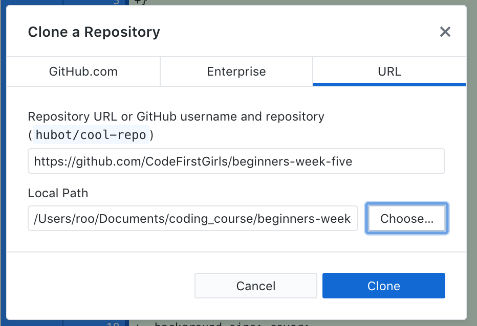

# Bootstrap

Welcome to twitter bootstrap! This is a template website that you will use to experiment with the framework, adding components and adjusting the styles accordingly. You will revisit this throughout the session but first, you will need to download it to your machine.

## First Task
- Click on the 'Fork' icon on the top right of the page, and fork it into your github account.
You will now have your own copy of this excercise on your github profile.
- Navigate to your version of this project.
- Click 'clone or download'.
- Select the 'open in desktop' option.
- Clone the repo into your coding_course folder, here is an example:
- Open the folder in Atom.

## Second Task
Link the bootstrap CSS into your HTML.

You can find this by looking for the CDN link on [Bootstrap.com](https://getbootstrap.com/docs/4.1/getting-started/introduction/)

## Third Task
1. Add an image into each of the columns and remove the text
2. Add a new row in the page that has two columns, with a block of writing in each.
3. Add a Carousel to the top of your page, with pictures! [instructions here](https://getbootstrap.com/docs/4.1/components/carousel/)
4. Add a modal to your page [instructions here](https://getbootstrap.com/docs/4.1/components/modal/)
5. Write over bootstrap! In the 'styles.css' file, change the design of the default CSS styles (this could be colors, fonts, images - the website is your oyster)
6. Add any more boostrap componenets you think look cool!
